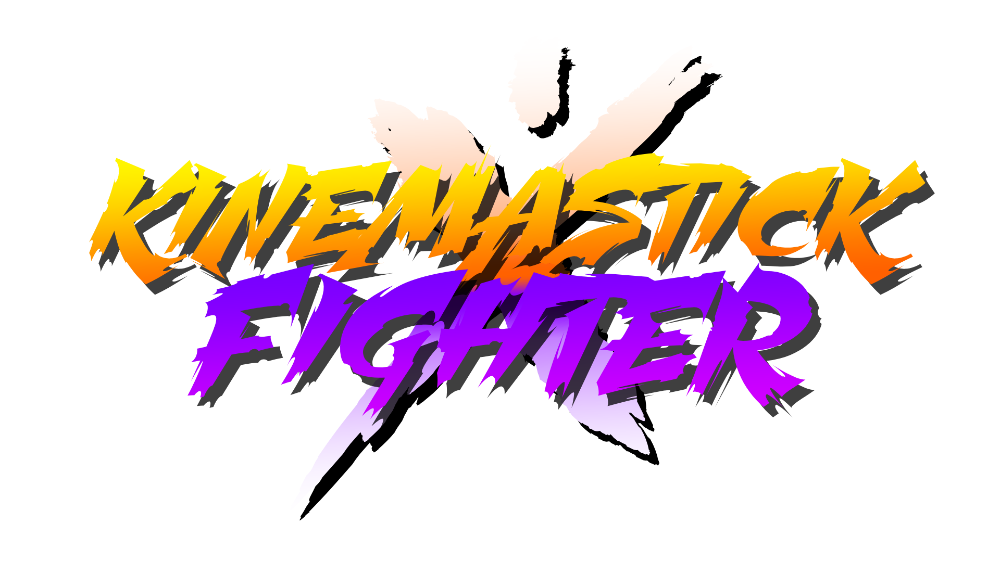

<p align="center">
  
</p>

<p align="center"><em>2-player WebGL fighting game built on a hierarchical skeleton model</em></p>

---

## play

open `html/index.html` in a browser.

## controls

| | player 1 | player 2 |
|---|---|---|
| move | A / D | J / L |
| jab | Q | U |
| kick | E | O |
| parry | S | K |

## stack

- vanilla JS + WebGL
- hierarchical skeleton with FK + foot IK
- keyframe animation system with pose blending

## project structure

```
js/
  core/     # webgl setup, render loop
  game/     # game state, input, ui
  anim/     # animations, player, ik solver
css/        # styles and assets
html/       # entry point
common/     # webgl utilities (MV.js, initShaders)
```
